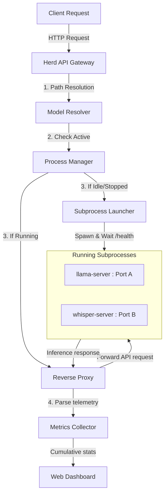

# Architecture & Design Guide

This document describes the internal architecture of Herd, detailing how it coordinates subprocesses, allocates network ports, and manages the model lifecycle.

---

## ⚙️ Core Architecture Overview

Herd is built as a modular ASGI application (FastAPI) acting as a smart, dynamic reverse-proxy. Under the hood, it orchestrates standard C++ implementations: `llama-server` (from `llama.cpp`) and `whisper-server` (from `whisper.cpp`).



---

## 1. Subprocess Port Management & Allocation

To avoid port conflicts, Herd runs each backend model server on a unique loopback port.

*   **Finding Free Ports**: When launching a model, the `ProcessManager` binds a temporary socket on `127.0.0.1:0` to let the OS assign an available free ephemeral port, closes the socket, and hands that port number to the new subprocess.
*   **Ready Check Pipeline**: 
    1. The subprocess is spawned.
    2. The manager polls the TCP port (waiting up to 30s) to verify binding.
    3. For LLM servers, the manager polls the server's `/health` endpoint until it transitions from `503 Service Unavailable (Loading model)` to `200 OK`. This guarantees no request experiences loading timeouts.

---

## 2. On-Demand Lifecycle & Idle Timeout

To conserve CPU/GPU and VRAM, Herd manages model runtimes dynamically:

*   **Auto-loading**: Requests sent to endpoints like `/v1/chat/completions` automatically start the required model in the background if it isn't running.
*   **Idle Detection**: Every request to a model updates its `last_accessed` timestamp in the process registry.
*   **Cleanup Loop**: A background thread runs every 10 seconds. Any active model process whose idle duration (`time.time() - last_accessed`) exceeds the `idle_timeout` is gracefully terminated (`SIGTERM`, falling back to `SIGKILL` after 5 seconds if unresponsive).

---

## 3. Path-Based Process Tracking (Deduplication)

Earlier versions tracked models by their raw requested strings. This led to issues if the same GGUF file was requested via different alias/tag variations (e.g. `Qwen` vs `Qwen:latest`), causing multiple processes to spawn for the same file.

To solve this:
1. When a model request comes in, the gateway runs `resolve_model_path()`.
2. This resolves the tag to its absolute location on disk (e.g., `/home/user/.herd/models/huggingface/author/repo/model-q4_k_m.gguf`).
3. The process registry is keyed strictly by this **absolute model file path**. If the path is already running, the gateway routes the query to the existing port immediately, regardless of what alias or tag the client passed.

---

## 4. Observability Pipeline

Herd collects telemetry data transparently during request proxying:

*   **Resource Footprint**: The `/v1/models/active` endpoint calls `psutil` to recursively sum the CPU usage (%) and Resident Set Size (RSS memory) of the model's server process and all of its spawned child processes.
*   **Token Metrics (LLM)**: For both streaming and non-streaming responses, Herd proxies the response bytes chunk by chunk. In the background, it accumulates the payload and parses it using regex matching patterns to extract exact token statistics:
    ```python
    match_prompt = re.search(r'"prompt_tokens"\s*:\s*(\d+)', response_text)
    match_completion = re.search(r'"completion_tokens"\s*:\s*(\d+)', response_text)
    ```
    This yields exact prompt/completion token totals and throughput speeds (tokens/second) without adding parsing latency.
*   **Word-Count Metrics (Speech-to-Text)**: For Whisper transcription, completion token counts are estimated based on word counts of the generated transcripts.
*   **Prometheus Exposer**: The gateway formats these metrics on `/metrics` using standard Prometheus gauge and counter structures, making integration with monitoring stacks plug-and-play.
